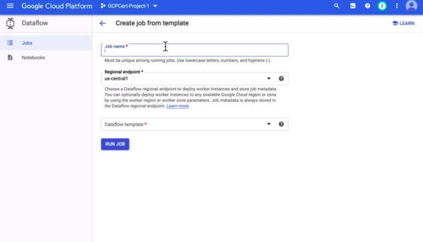
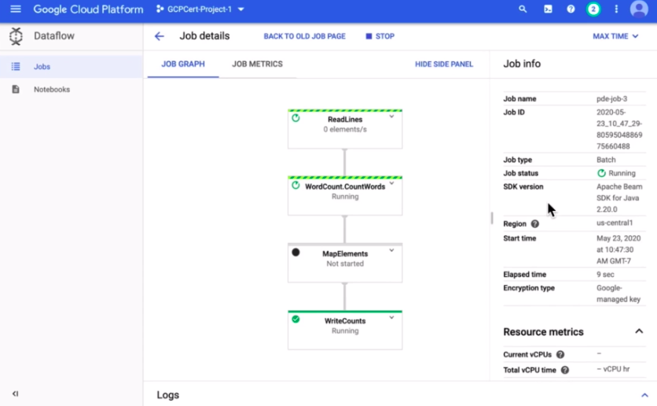

# machine-learning
This Repo contains Google Cloud oriented data loading and machine learning examples and templates.
--------------------------------------------------------------
Table of contents placeholder

--------------------------------------------------------------

Comparing the Machine Learning (ML) options available in GCP :
- Cloud AutoML - for those who want to use read-to-use models and bild their own soluton on it
- BigQuery ML - allows SQL users to build ML solution based on data in BigQuery and avoid having to export data to develop models in Java or Python
- Kubeflow - supports deploying scalable pipelines in Kubernetes and contenerized worlds
- Spark MLLib - is comprehensive set of math and ML tools that can be used when deploying Cloud Dataproc cluster
  
--------------------------------------------------------------
# BigQuery Machine Learning (BigQuery ML)
## 1. BigQuery overview
### 1.1 BigQuery Managed Storage Warehouse
Foundtion of BigQuery service : 
- Managed services - provisioning underlaying vm-s, patching, maintaining, backups etc is Google responsabilities
- Serverless data warehouse:
  - petabyte scale
  - uses SQL but is not a relational database :
    - Tables are stored in optymized columnar format
    - Each table is compresed and encrypted on disk
- Storage is durable and each table is replicated across datacenters
- Supports natively batch and streaming ingestion

For BigQuery detailed documentations see: https://cloud.google.com/bigquery/docs
### 1.2 BigQuery Datasets & Tables
BigQuery has a logical structure that organizaes data around struture called __Dataset__. 
- Dataset is a collection of tables and views
- Access control is set at dataset level
- Tables :
  - support scalar formats but nested and repeated structures as well
  - partitioning makes easier to  isolate the data that is usefull to respond to a particular query and it reduces amount of scanning (which is important from biling perspective).
- Views :
  - similar to traditional data bases - it is projection of one or more tables (plus agregation, filtering etc)
  - tables can be joined
  - views can be materialized
- Federated Data Access - you can access and query data that`s stored in different storage system: 
  - Cloud Storage :
    - Parquet
    - ORC
  - Bigtable (Google Cloud Bigdata storage system) and Cloud SQL
  - Spreadsheets in Google Drive
### 1.3 BigQuery Machine Learning
BigQueryML - excellent choice for persons who knows SQL, manipulation on data and have good understanding of busines problem to solve.
- Create machine learning models in SQl
- Several kinds of models:
    - Linear regression
    - Binary and multiclass logistic regressions
    - K-menas clustering
    - Time series forecast
    - Matrix factorisation
    - Bosted Tree and XGBoost
    - TensorFlow (imported)
- AutoML Tables = interesing feature for those who does not much to know about ML but rather has expertise in business domain

## 2. Data loading examples
This chapter explains step-by-step how to ingest data into a BigQuery Data Warehouse starting from the simplest way direct batch loading.

Batch loading process can be managed in following steps:
1. Load the data source files (sometimes called feeds) into Google Cloud Storage. GCS can be viewed as Data Lake component. As a principle use: one batch = one file in GCS = one raw-data table.
2. Next load the files into BigQuery Raw Data area using Dataflow. Use simple checks to pass proper records only or augment the default parameters. This is the first step of data cleansing.
3. Transform data from Raw Data into Staging Area tables using SQL language to easily transform data, join data from multiple raw data sources, calculate some missing parameters (eg. agregation) etc.
4. Staging Area are - so called - golden source of information for reporting or machine-learning purposes.
5. Steps 4 and 5 can be split into several subtasks if needed; it can be easily managed by using Cloud Composer service.

In the next sections we see (in the Lab manner) how to load the data using several approaches:
1. Direct batch ingestion - loading data directly from the Google Cloud Storage
2. Batch loading data using a Dataflow Template (from the console)
3. Batch loading data running simple Dataflow pipeline (from the Cloud Shell)
4. Streaming loading using Dataflow + Pub/Sub queues (comming soon)
### 3.1 Lab  1: Direct batch ingestion
This scenario is based on loading files directly from Google Cloud Storage (GCS) __without__ Dataflow service. In that case GCS can be seen like a Data Lake component, which manages the archive source data (it means already loaded data) as well. GCS is cloud cheapest storage so it is optimal in terms of cost and project budget. 
Using GCS as a starting point should be common element of every batch loading solution architecture.

#### Step 1 Setup and requirements
- Signin to Cloud Console and create a new project or reuse an existing one. (If you don't already have a Gmail or G Suite account, you must create one.). Note : memorize the url : __console.cloud.google.com__.
- From the cosole, run the Cloud Shell
- Run the following command in Cloud Shell to confirm whether you are authenticated:
```
gcloud auth list
```
  - in response, you shoud see in Cloud Shell the following command output :
```
 Credentialed Accounts
ACTIVE  ACCOUNT
*       <my_account>@<my_domain.com>
```
- To set the active account, run:
```
    $ gcloud config set account `ACCOUNT`
```
- list the available projects
```
gcloud config list project
```
  - the expected outpot should looks like this
```
[core]
project = <PROJECT_ID>
```
  - if NOT, setup the project, using bellow commands
```
gcloud config set project <PROJECT_ID>
```

#### Step 2 Move data from a file system into Cloud Storage
- From: https://github.com/dakoncewicz/machine-learning/resources/source-files/babynames download names.zip file. Then unpack this file on your local machine.
- In the Cloud Shell, first create `ml-my-bucket` bucket in `us-east1` location than load sample files from local drive.
```
$ gsutil mb  -c standard -l us-east1 gs://mlbq-my-bucket
$ gsutil mv ./dir gs://mlbq-my-bucket
```
#### Step 3 Load data from GCS to BigQuery
- In the Cloud Shell run the following command
```
 bq load —source_format=CSV \ 
> gs://mlbq-my-bucket/babynames/*.txt \
> name:string,gender:string,count:integer 
```
- __Note:__
  - --source_format=CSV - specify the load file format
  - line 'name:string,gender:string,count:integer' specifies the schema
- be aware of some limitations when using bq load command
  - CSV files do not support nested or repeated data.
  - Remove byte order mark (BOM) characters. They might cause unexpected issues.
  - If you use gzip compression, BigQuery cannot read the data in parallel. Loading compressed CSV data into BigQuery is slower than loading uncompressed data.
  - other limitations see: https://cloud.google.com/bigquery/docs/loading-data-cloud-storage-csv#limitations
  
#### Step 4 Verify whether data is loaded correctly
- in the Cloud Shell run the query
```
$ bq query “SELECT name, count FROM babynames.all_names WHERE gender = 'F’ ORDER BY count DESC LIMIT 5"
```
- OR you can export loaded data from BigQuery as well
```
$ bq export <tablename> gs://<bucket name> / <filename.csf>
```

#### Summary
This Lab demonstrates how to simply load text files into BigQuery table. 

### 3.2 Lab 2: Dataflow template
#### Dataflow quick overview
Dataflow is a managed service for executing a wide variety of data processing patterns, built up on the Apache Beam project.
The Apache Beam documentation (ref: https://beam.apache.org/documentation/ ) provides in-depth conceptual information and reference material for the Apache Beam programming model, SDKs, and other runners.

This Lab provides a few steps to implement and run simple dataflow job transforming input file and counting how many times aeach word occours in text input files. Lab demonstrates how to use in Google Console predfined Dataflow templates. 
Next Lab will explain how to write simple dataflow job using Python.

#### Step 1 Create dataflow job from the template
- open the Console and navigate to the Dataflow panel
- go to the Dataflow >> Jobs >> Create job from a template
  


- on the screen define new job, setting up the bellow parameters:
  - Job name: `dfl-job-lab2`
  - Dataflow temlplate: `wordcount`
  - Input file(s) in Cloud Storage: `gs://dataflow-samples/shakespeare/kinglear.txt`
  - Output Cloud Storage file prefix: `gs://mlbq-my-bucket/counts`
  - Temporary location: `gs://mlbq-my-bucket/temp`
  - Encryption: leave the option `Google-managed key`

#### Step 2 Run the Job
- Click the button [__RUN JOB__]
- Within a few seconds you will see the Job Graph, like is shown on bellow picture.



#### Step 3 Check the result
- Go to the Cloud Storage `mlbq-my-bucket` and open one of `counts-00000n-of-00003` files

- files contain the partly results of counting the words in public input text file __kinglear.txt__
#### Summary
This Lab demonstrates how to use Dataflow predefined template to run simple Dataflow job. Job that we have ran simply counts how many times each word appears in input file. The main ideas are:
- we can use some of templates to transform source data into data sink; in that case both are text files but we can easily transform source data into eg. BigQuery table.
- using Dataflow we can not only load the data from one place to another but make some transformations as well. 

### 3.3 Lab 3: Dataflow simple pipeline
This Lab demonstrates how to write simple dataflow job using Python. This job countes how many times words occour in source files. In this case counting file will be sample text kinglear.txt. Ref: `gs://dataflow-samples/shakespeare/kinglear.txt`
__Important Note:__ Dataflow no longer supports pipelines using Python 2. For more information, see Python 2 support on Google Cloud page https://cloud.google.com/dataflow/docs/quickstarts/quickstart-python?refresh=1#:~:text=Dataflow%20no%20longer%20supports%20pipelines%20using%20Python%202.%20For%20more%20information%2C%20see%20Python%202%20support%20on%20Google%20Cloud%20page.

Lab is splited into two phases :
- demonstrates how to run sample Python programm on `Colab` environment using Apache Beam python library
- next how to run cloud version of this programm into Google Cloud environemnt
- you can compare this two versions of the same functionality ran on Colab and in cloud environment - both using Apache Beam. 
#### Step 1 Run the wordcount_local.py program localy on Colab
- clone the  repo https://github.com/dakoncewicz/machine-learning/dataflow-simple-pipeline  to your local machine 
- run downloaded Python code in Google Colab environment - goto https://colab.research.google.com/
  - in colab install the apache_beam package
```
!{'pip install --quiet apache_beam'}
```
  - next, copy your file `wordcount-local.py` to Colab cell and afterward run this code.
  - check the result of calculation printing the first 20 line of the results, remember there are no ordering guarantees; in the next Colab cell, type
```
#!{('head -n 20 {}-00000-of-*'.format(<OUTPUT_PREFIX>)}
```
Note: to run this code from Cloud Shell see: https://cloud.google.com/dataflow/docs/quickstarts/quickstart-python?refresh=1 as an guideline.

#### Step 2 Run the wordcount_cloud.py using Dataflow
- on your left side navigation bar go to Dataflow 
- Note : while using Dataflow in a Cloud we cannot get the file from a local machine, we need to copy this sample java files onto GCP. In this Lab it is unnecessary once we use google sample text
- otherwise run the command to copy your own text files instead of
```
$ gsutil cp ./java/*.java gs://mlbq-my-bucket/java
```
- enable Dataflow API 
  - from leftside navigation bar select the API Manager > Dashboard and run it
  - click the button [Enable API] on the top
  - search the Dataflow 
- within the programm `wordcount_cloud.py` check the variables: PROJECT_ID, BUCKET _ID and BUCKET_FOLDER
- run the cloud version of wordcount programm
```
$ python wordcount_cloud.py --input gs://dataflow-samples/shakespeare/kinglear.txt --output outputs/count
```

#### Step 4 Check your Lab succesed 
- go to the Cloud Console and in the Dataflow service find the job `goodjob`, click on it
- on the right side bar menu you can find the basic metrics of the Dataflow job
#### Step 5 Clean your resources
To avoid incurring charges to your Google Cloud account for the resources used on this page, follow these steps.

Note: If you followed this quickstart in a new project, then you can delete the project.
In the Cloud Console, go to the Cloud Storage Browser page.
[`Go to Browser`]

Click the checkbox for the bucket that you want to delete.
To delete the bucket, click [`Delete`] button, and then follow the instructions.

### 3.4 Lab 4:  Writing ouput to BigQuery table

### 3.5 Lab 5: Using DLP (Data Loss Prevention) to secure PII data
https://cloud.google.com/architecture/de-identification-re-identification-pii-using-cloud-dlp


### 3.6 Lab 6: Dataflow streaming ingestion using Pub/Sub Google Cloud queueing system (comming soon)